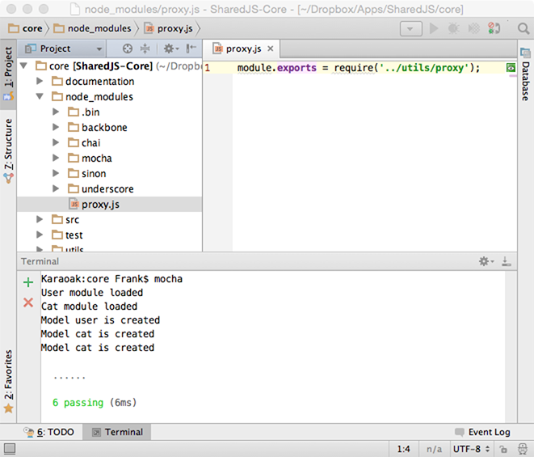

# SharedJS Core JS library
CommonJS Mocha testable shared JavaScript library. This project is a dependency for the following projects:

* [SharedJS.Web](https://github.com/karaoak/SharedJS.Web)
* [SharedJS.App](https://github.com/karaoak/SharedJS.App)
	
## Purpose of this PoC library
Share as many code as possible in both Web and Mobile JS applications. This PoC library is set up in such a way that e.g. the same business logic and state, but e.g. different persistency, audioplayer or Google analytics implementations can be applied in both web and app projects.

###Why a shared JS codebase

* Just like we use Titanium to develop apps for both iOS + Android, why not use JS to …
* Take away inconsistencies between mobile app and web app logic.
* Keep things DRY, why write something in JS twice?
* Reduce TCO. Cut costs for both initial development + AM

###Objectives
* Keep business logic in one place
* Unit test business logic once
* Leverage context specific technologies:
	* HTML5 BB Web App: It should be possible to use BB plugins like LayoutManager + Stickit
	* Ti Alloy App: It should be possible to use Alloy views and Alloy MV binding.
* Keep it very simple! With very little, and no exotic, dependencies.

	
###Setup insctructions
Setting up this project would require the following:

	$ npm install
	
####proxy shim
Apart from that to load our dependencies via node require, we need a shim for Mocha testing.
To achieve this, we made a very cheap shim leveraging the way node uses node_modules as a search path when searching for modules. For this reason in node_modules we create a custom proxy.js which serves as a proxy of its own for our local project utils/proxy.js module.
We explicitly added this file to git while ignoring everything else inside the node_modules folder.

###Test instructions
Either use the repository grunt tasks to test the library or use.

    $ mocha
    
    
### Documentation
Please find a list of the main libraries and modules used in this project:

* [CommonJS](http://wiki.commonjs.org/wiki/CommonJS)
* [Mocha](http://visionmedia.github.io/mocha/)

For more information see my slides on [Speakerdeck](https://speakerdeck.com/karaoak/shared-web-plus-ti-app-javascript-codebase)

